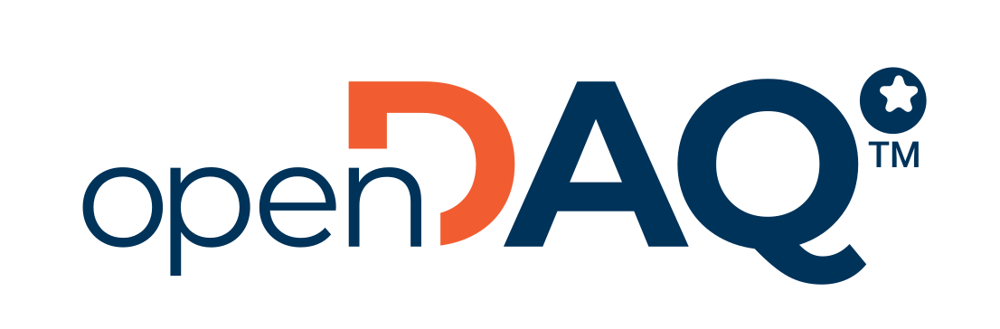

<h3 align="center">
    <a href="https://opendaq.com" target="blank_">
        
    </a>
    <br>
    SDK that bridges the gap between data acquisition devices, in an era where incompatibility is the norm
</h3>

---

# iDDS Modules for openDAQ

An open-source implementation of iDDS (Instrumentation Data Distribution Service) developed using CycloneDDS for openDAQ ([CycloneDDS C++ Binding](https://github.com/eclipse-cyclonedds/cyclonedds-cxx)).

iDDS is an embedded application protocol for data acquisition and control instruments. It uses Data Distribution Service (DDS), a widely adopted data communications protocol that follows a data-centric model.

## Features

- Open-source iDDS wrapper built on top of CycloneDDS
- **idds-xml-parser** for schema validation, encoding, and decoding of iDDS commands
- **Node discovery** for automatic detection of connected iDDS devices
- **Infrastructure to send and receive commands** from other iDDS nodes
- **Data streaming support** for real-time data exchange
- **Interoperability** with other iDDS implementations
- **Configurable QoS** for flexible integration
- **Client/Server openDAQ modules** to streamline test system development

---

## Folder Structure
```
.
├── cmake                # CMake scripts
├── CMakeLists.txt       # Top-level CMake file
├── examples             # Examples folder
├── external             # External libraries and dependencies
├── idds_client_module   # Client-side implementation of the openDAQ iDDS module
├── idds_server_module   # Server-side implementation of the openDAQ iDDS module
├── idds_wrapper         # Wrapper code around CycloneDDS
├── idds_xml_parser      # XML parser for the iDDS Command subsystem
├── LICENSE              # License file
└── README.md            # Project documentation
```

---

## Build Instructions

By default, these options are enabled:
```cmake
set(IDDS_ENABLE_EXAMPLE "Enable Examples" ON)
set(IDDS_ENABLE_TESTS   "Enable Tests" ON)
```

### Linux Build Instructions
```sh
# On a clean repository:
mkdir build
cd build
cmake ..
cmake --build --parallel
```

### Windows Build Instructions (Visual Studio 2022)
```sh
# On a clean repository:
cmake -S . -B build -G "Visual Studio 17 2022" -A x64
cmake --build build
```

---

## Running Examples

### Running Two iDDS Devices
This example demonstrates the operation of two iDDS devices using the iDDS wrapper.

1. **Simple Device Example:**
   - Creates an instance of an iDDS device.
2. **Complete Device Example:**
   - Creates an iDDS device instance.
   - Prints available iDDS devices.
   - Sends a `Configuration.GetAttribute` command.
   - Subscribes to a `channelID`.
   - Sends `General.StartOperating` and `General.StopOperating` commands.
   - Requires user input between stages.
   - By default, all subscribed channels will be printed.

#### Example Signal Channels (Implemented in iDDS Wrapper):
- **Sine Wave:** `Channel.1 (Name) - 6445 (ID)`
- **Saw Tooth Wave:** `Channel.2 (Name) - 6446 (ID)`

#### Running the Example:
```sh
cd build/bin
./idds-simple-device
```
On another terminal instance:
```sh
./idds-complete-device
```

---

## iDDS Network and Nodes
Nodes in an iDDS network advertise their presence and nature using periodic advertisement messages every 5 seconds. A network host can support multiple nodes, each identified by a **system-wide unique node identifier** (e.g., `<mac>-<application>`). Nodes can also have logical identifiers and are referenced in control messages using their unique identifiers.

### Wrapper Implementation Details
The iDDS wrapper currently implements **three DDS topics**:

1. **`ParameterDataSeries`** (Domain 2) - Used for data streaming.
2. **`Message`** (Domain 0) - Used for sending commands between iDDS devices.
3. **`AboutNode`** (Domain 0) - Used for node discovery.

The IDL definition for these topics can be found in:
```
idds_wrapper/idl/iDDS.idl
```
